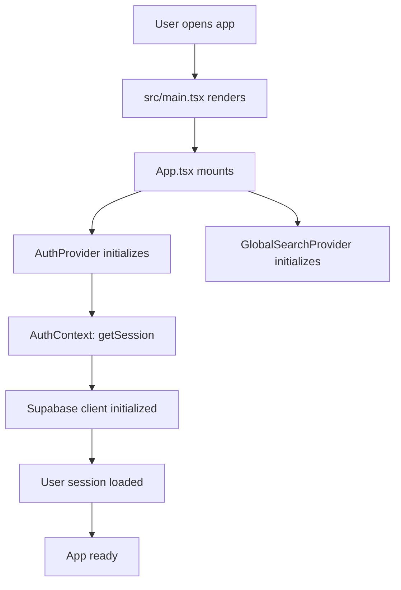
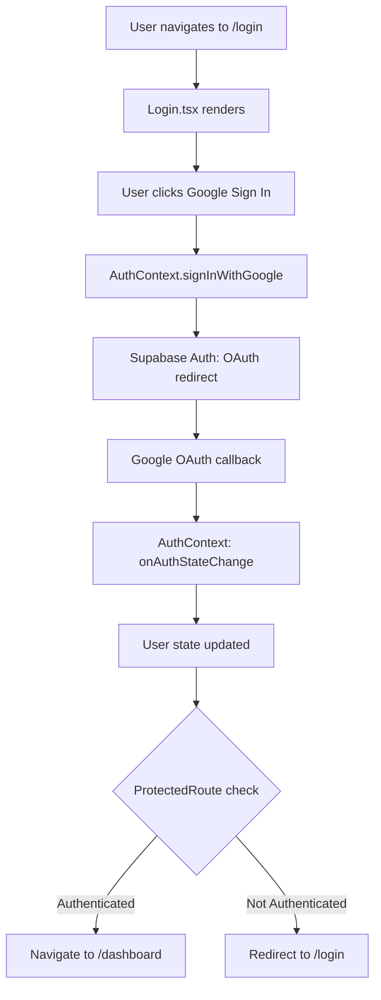
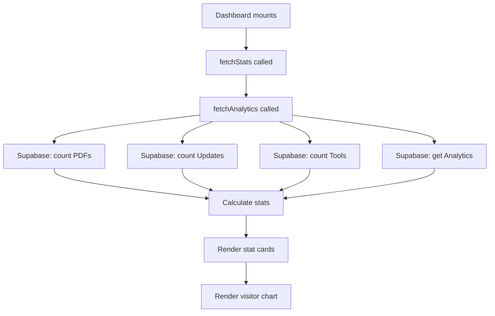
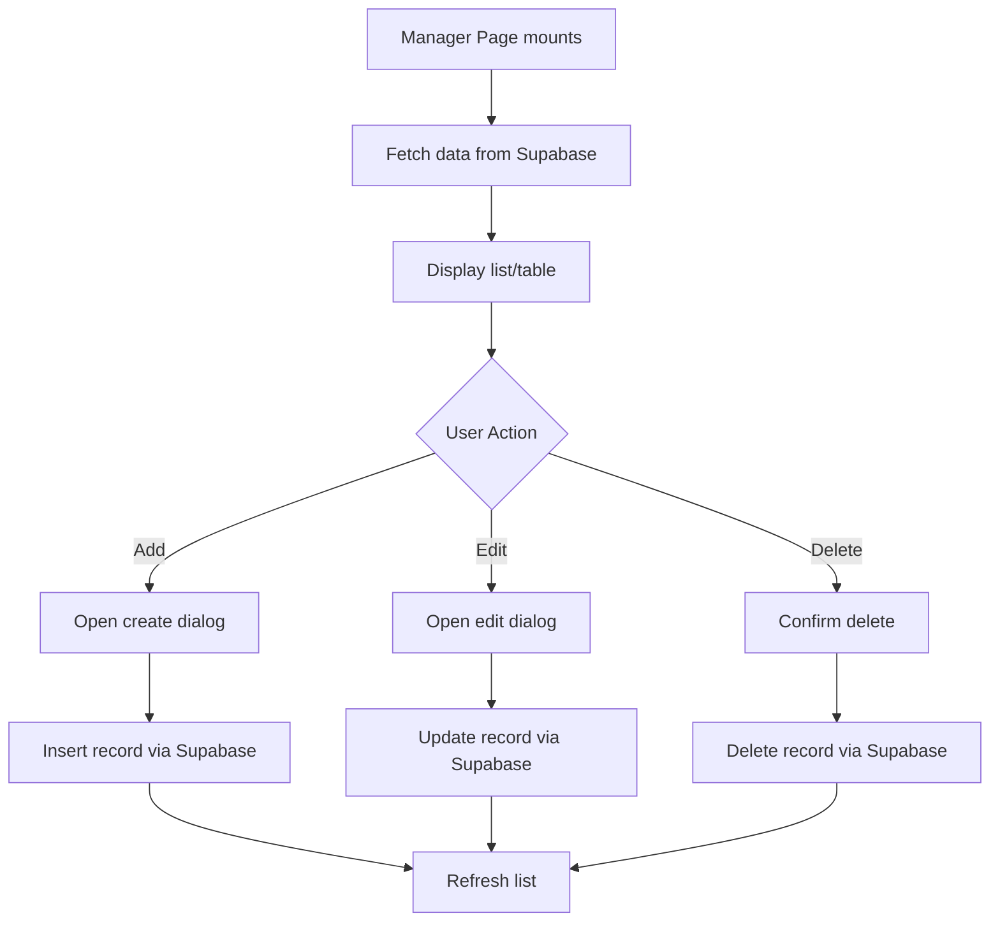
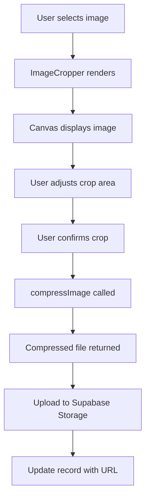
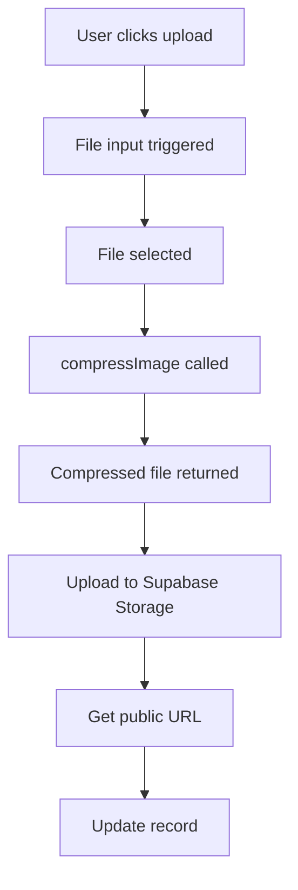
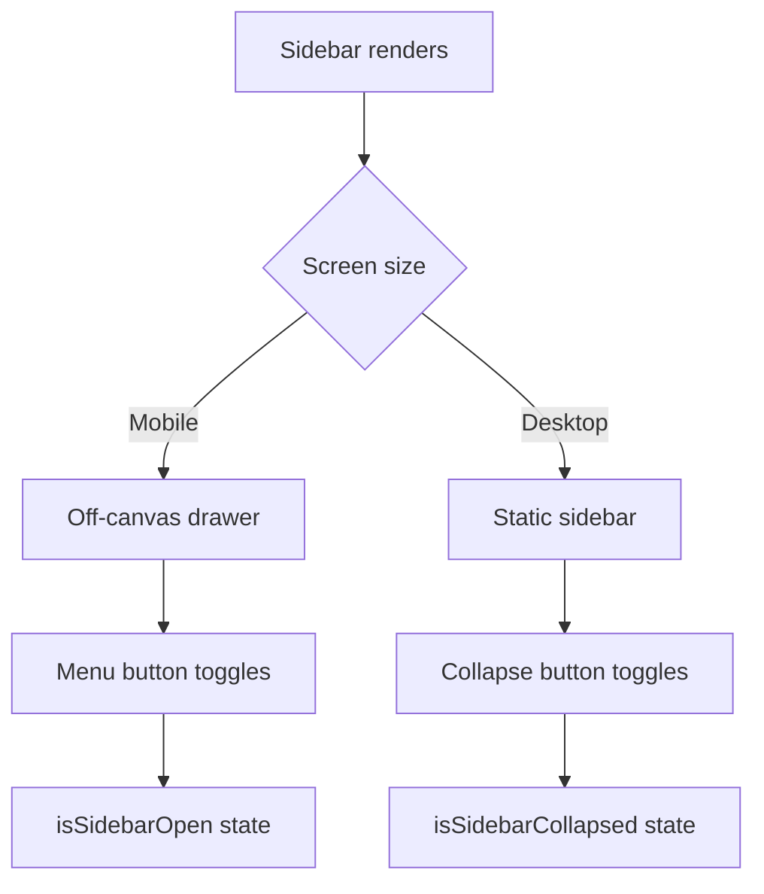
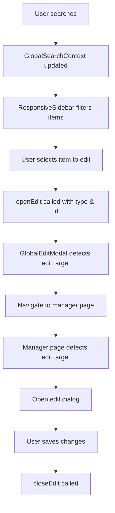

# edudock-admin Workspace Overview

## 🏗️ Workspace Overview

**Project Name:** edudock-admin  
**Description:** Admin dashboard for managing categories, messages, PDFs, tools, and updates.  
**Tech Stack:** React 19.2.4, TypeScript, Vite, Tailwind CSS 4.2.2, Supabase, React Router DOM 7.14.1  
**Backend:** Supabase (PostgreSQL), Supabase Auth (Google OAuth), Supabase Storage, Edge Functions  
**Build Tool:** Vite  
**Language:** TypeScript  

**Purpose:** Admin dashboard for managing categories, messages, PDFs, tools, and updates.  

**Key Features:**
- Category management
- Message management
- PDF management (upload & Google Drive links)
- Tool management
- Update management
- Image cropping/uploading with compression
- Responsive sidebar with collapse functionality
- Global search and edit functionality
- Google OAuth authentication
- Protected routes
- Analytics dashboard with visitor tracking
- Toast notifications

**Architecture:**
- **Application Type:** Single Page Application (SPA) with React Router
- **State Management:** React Context (AuthContext, GlobalSearchContext)
- **Styling:** Tailwind CSS 4.2.2 with Radix UI components
- **Data Layer:** Supabase Client ([`src/lib/supabase.ts`](src/lib/supabase.ts:1))
- **Build System:** Vite
- **Testing:** ESLint for linting
- **Deployment:** Static hosting (Vite build output)

**Project Structure:** Monorepo with clear separation of concerns (UI components, Pages, Types, Libs, Hooks, Contexts)

---

## 📂 File Tree

```text
index.html (Root HTML entry point)
├── src/main.tsx (Entry Point - React root rendering)
│   └── src/index.css (Global Styles - Tailwind directives)
│   └── src/App.tsx (React Root - Router configuration)
│       └── src/contexts/ (React Contexts - State Management)
│       │   ├── AuthContext.tsx (Authentication state & Google OAuth)
│       │   └── GlobalSearchContext.tsx (Global edit target management)
│       └── src/components/ (UI Components)
│       │   ├── admin/ (Admin layout components)
│       │   │   ├── AdminLayout.tsx (Main layout wrapper with Sidebar + Header)
│       │   │   ├── Header.tsx (Top navigation bar with user info)
│       │   │   └── Sidebar.tsx (Navigation sidebar with collapse)
│       │   ├── auth/ (Authentication components)
│       │   │   └── ProtectedRoute.tsx (Route guard for authenticated users)
│       │   ├── shared/ (Shared/reusable components)
│       │   │   ├── GlobalEditModal.tsx (Navigation handler for global edits)
│       │   │   ├── ImageCropper.tsx (Canvas-based image cropping)
│       │   │   ├── ImageUploader.tsx (File upload with compression)
│       │   │   ├── ResponsiveSidebar.tsx (Mobile-responsive sidebar)
│       │   │   └── responsive-sidebar-demo.html (Demo HTML file)
│       │   └── ui/ (Reusable UI Kit - Radix UI based)
│       │   │   ├── button.tsx (Button component)
│       │   │   ├── dialog.tsx (Dialog/Modal component)
│       │   │   ├── input.tsx (Input field component)
│       │   │   ├── label.tsx (Label component)
│       │   │   ├── table.tsx (Table component)
│       │   │   ├── textarea.tsx (Textarea component)
│       │   │   ├── toast.tsx (Toast notification component)
│       │   │   └── toaster.tsx (Toast container/provider)
│       ├── hooks/ (Custom Hooks)
│       │   └── use-toast.ts (Toast notification hook)
│       ├── lib/ (Utilities & Core Logic)
│       │   ├── imageCompression.ts (Image compression utilities)
│       │   ├── storageUtils.ts (Supabase storage utilities)
│       │   ├── supabase.ts (Supabase client & constants)
│       │   └── utils.ts (General utility functions)
│       ├── pages/ (Page Components - Route handlers)
│       │   ├── CategoriesManager.tsx (Category CRUD operations)
│       │   ├── Dashboard.tsx (Analytics & stats overview)
│       │   ├── Login.tsx (Google OAuth login page)
│       │   ├── MessagesManager.tsx (Message CRUD operations)
│       │   ├── PdfsManager.tsx (PDF CRUD with upload/Drive links)
│       │   ├── ToolsManager.tsx (Tool CRUD operations)
│       │   └── UpdatesManager.tsx (Update CRUD operations)
│       ├── types/ (Type Definitions)
│       │   ├── category.ts (Category interfaces)
│       │   ├── message.ts (Message interfaces)
│       │   ├── pdf.ts (PDF interfaces)
│       │   ├── tool.ts (Tool interfaces)
│       │   └── update.ts (Update interfaces)
├── supabase/functions/ (Edge Functions)
│   └── delete-storage-file/ (Storage file deletion)
│   │   ├── import_map.json (Deno import map)
│   │   └── index.ts (Edge function implementation)
├── migrations/ (Database Migrations)
│   ├── fix_rls_policies.sql (Row Level Security fixes)
│   └── master_setup.sql (Initial database schema)
├── scripts/ (Utility Scripts)
│   └── check-db.js (Database connection checker)
├── plans/ (Project Plans)
│   └── sidebar-roll-in-out-plan.md (Sidebar feature plan)
├── Configuration Files
│   ├── package.json (Dependencies & scripts)
│   ├── tsconfig.json (TypeScript config)
│   ├── tsconfig.app.json (App TypeScript config)
│   ├── tsconfig.node.json (Node TypeScript config)
│   ├── tailwind.config.js (Tailwind CSS config)
│   ├── postcss.config.js (PostCSS config)
│   ├── vite.config.ts (Vite build config)
│   ├── eslint.config.js (ESLint config)
│   ├── components.json (shadcn/ui config)
│   ├── .env (Environment variables)
│   └── .gitignore (Git ignore rules)
├── public/ (Public Assets)
│   └── favicon.svg (Favicon)
└── src/assets/ (Source Assets)
    ├── hero.png (Hero image)
    ├── react.svg (React logo)
    └── vite.svg (Vite logo)
```

---

## 🔗 File Connection Map

Dependencies between core modules

### Entry Point & Routing
- [`src/main.tsx`](src/main.tsx:1) → imports [`src/App.tsx`](src/App.tsx:1) → Root Component
- [`src/App.tsx`](src/App.tsx:1) → renders [`src/main.tsx`](src/main.tsx:1) → Main App Structure
- [`src/App.tsx`](src/App.tsx:1) → uses [`src/contexts/AuthContext.tsx`](src/contexts/AuthContext.tsx:1) → Auth Provider
- [`src/App.tsx`](src/App.tsx:1) → uses [`src/contexts/GlobalSearchContext.tsx`](src/contexts/GlobalSearchContext.tsx:1) → Global Search Provider
- [`src/App.tsx`](src/App.tsx:1) → uses [`src/components/shared/GlobalEditModal.tsx`](src/components/shared/GlobalEditModal.tsx:1) → Global Edit Handler
- [`src/App.tsx`](src/App.tsx:1) → uses [`src/components/ui/toaster.tsx`](src/components/ui/toaster.tsx:1) → Toast Container

### Pages & Data Layer
- [`src/pages/Dashboard.tsx`](src/pages/Dashboard.tsx:1) → uses [`src/lib/supabase.ts`](src/lib/supabase.ts:1) → Data Layer
- [`src/pages/CategoriesManager.tsx`](src/pages/CategoriesManager.tsx:1) → uses [`src/lib/supabase.ts`](src/lib/supabase.ts:1) → Data Layer
- [`src/pages/MessagesManager.tsx`](src/pages/MessagesManager.tsx:1) → uses [`src/lib/supabase.ts`](src/lib/supabase.ts:1) → Data Layer
- [`src/pages/PdfsManager.tsx`](src/pages/PdfsManager.tsx:1) → uses [`src/lib/supabase.ts`](src/lib/supabase.ts:1) → Data Layer
- [`src/pages/ToolsManager.tsx`](src/pages/ToolsManager.tsx:1) → uses [`src/lib/supabase.ts`](src/lib/supabase.ts:1) → Data Layer
- [`src/pages/UpdatesManager.tsx`](src/pages/UpdatesManager.tsx:1) → uses [`src/lib/supabase.ts`](src/lib/supabase.ts:1) → Data Layer

### Shared Components & Utilities
- [`src/components/shared/ImageCropper.tsx`](src/components/shared/ImageCropper.tsx:1) → uses [`src/lib/imageCompression.ts`](src/lib/imageCompression.ts:1) → Image Utility
- [`src/components/shared/ImageUploader.tsx`](src/components/shared/ImageUploader.tsx:1) → uses [`src/lib/imageCompression.ts`](src/lib/imageCompression.ts:1) → Image Utility
- [`src/components/shared/ImageUploader.tsx`](src/components/shared/ImageUploader.tsx:1) → uses [`src/lib/storageUtils.ts`](src/lib/storageUtils.ts:1) → Storage Utility
- [`src/components/shared/ResponsiveSidebar.tsx`](src/components/shared/ResponsiveSidebar.tsx:1) → uses [`src/contexts/GlobalSearchContext.tsx`](src/contexts/GlobalSearchContext.tsx:1) → Search Context
- [`src/components/shared/GlobalEditModal.tsx`](src/components/shared/GlobalEditModal.tsx:1) → uses [`src/contexts/GlobalSearchContext.tsx`](src/contexts/GlobalSearchContext.tsx:1) → Search Context

### Layout Components
- [`src/components/admin/AdminLayout.tsx`](src/components/admin/AdminLayout.tsx:1) → uses [`src/components/admin/Header.tsx`](src/components/admin/Header.tsx:1) → Layout Composition
- [`src/components/admin/AdminLayout.tsx`](src/components/admin/AdminLayout.tsx:1) → uses [`src/components/admin/Sidebar.tsx`](src/components/admin/Sidebar.tsx:1) → Layout Composition
- [`src/components/admin/AdminLayout.tsx`](src/components/admin/AdminLayout.tsx:1) → uses [`src/contexts/AuthContext.tsx`](src/contexts/AuthContext.tsx:1) → Auth Context

### UI Kit Components
- [`src/components/ui/`](src/components/ui/) → Reusable UI Kit (Button, Dialog, Input, Label, Table, Textarea, Toast/Toaster)
- [`src/hooks/use-toast.ts`](src/hooks/use-toast.ts:1) → uses [`src/components/ui/toast.tsx`](src/components/ui/toast.tsx:1) → Custom Hook Wrapper
- [`src/components/ui/toaster.tsx`](src/components/ui/toaster.tsx:1) → uses [`src/hooks/use-toast.ts`](src/hooks/use-toast.ts:1) → Hook Consumer

### Authentication
- [`src/pages/Login.tsx`](src/pages/Login.tsx:1) → uses [`src/contexts/AuthContext.tsx`](src/contexts/AuthContext.tsx:1) → Auth Context
- [`src/components/auth/ProtectedRoute.tsx`](src/components/auth/ProtectedRoute.tsx:1) → uses [`src/contexts/AuthContext.tsx`](src/contexts/AuthContext.tsx:1) → Auth Context

### Type Definitions
- All pages → use [`src/types/`](src/types/) → Type definitions (category, message, pdf, tool, update)

---

## 🌊 System Flow Documentation

### 1. Initialization Flow



**Steps:**
1. **App mounts** ([`src/main.tsx`](src/main.tsx:1)): The application entry point that renders the main routing structure using `createRoot()`
2. **Auth Provider initializes** ([`src/contexts/AuthContext.tsx`](src/contexts/AuthContext.tsx:25)): Manages user authentication state (login/logout) with Google OAuth
3. **Global Search Context initializes** ([`src/contexts/GlobalSearchContext.tsx`](src/contexts/GlobalSearchContext.tsx:26)): Manages the global edit target state used across the app
4. **Supabase Client initializes** ([`src/lib/supabase.ts`](src/lib/supabase.ts:7)): Establishes the connection to the Supabase backend (PostgreSQL)

### 2. Authentication Flow



**Steps:**
1. User navigates to `/login` → [`src/pages/Login.tsx`](src/pages/Login.tsx:1)
2. `Login.tsx` calls `AuthContext.signInWithGoogle()`
3. `AuthContext` initiates Supabase OAuth with Google provider
4. Google OAuth redirects back with access token
5. `AuthContext` updates `user` and `session` state with the returned user object
6. **Protected Route** ([`src/components/auth/ProtectedRoute.tsx`](src/components/auth/ProtectedRoute.tsx:1)): Checks if `user` exists in `AuthContext`. If not, redirects to `/login`
7. If authenticated, redirect to `/dashboard` → [`src/pages/Dashboard.tsx`](src/pages/Dashboard.tsx:1)

### 3. Dashboard Flow



**Steps:**
1. `Dashboard.tsx` fetches stats (categories, messages, PDFs, tools, updates) from Supabase using [`src/lib/supabase.ts`](src/lib/supabase.ts:1)
2. Fetches analytics data for visitor tracking
3. Displays summary cards for each entity type
4. Renders visitor analytics chart using Recharts
5. Uses [`src/components/ui/`](src/components/ui/) components for consistent UI

### 4. Manager Pages Flow (CRUD Pattern)



All manager pages ([`CategoriesManager`](src/pages/CategoriesManager.tsx:1), [`MessagesManager`](src/pages/MessagesManager.tsx:1), [`PdfsManager`](src/pages/PdfsManager.tsx:1), [`ToolsManager`](src/pages/ToolsManager.tsx:1), [`UpdatesManager`](src/pages/UpdatesManager.tsx:1)) follow a similar CRUD pattern:

- **List:** Fetch data from Supabase using [`src/lib/supabase.ts`](src/lib/supabase.ts:1)
- **Add:** Insert new record into Supabase with optional file uploads
- **Edit:** Update existing record in Supabase
- **Delete:** Remove record from Supabase and associated storage files
- All managers use [`src/lib/supabase.ts`](src/lib/supabase.ts:1) for database operations

### 5. Shared Components Flow

#### ImageCropper Flow


- **ImageCropper.tsx:** Canvas-based component for cropping images. Uses [`src/lib/imageCompression.ts`](src/lib/imageCompression.ts:1) for client-side compression before saving
- Uses [`src/lib/storageUtils.ts`](src/lib/storageUtils.ts:1) for storage operations
- Uses [`src/contexts/GlobalSearchContext.tsx`](src/contexts/GlobalSearchContext.tsx:1) to trigger global updates when an image is cropped

#### ImageUploader Flow


- **ImageUploader.tsx:** File input component. Uses [`src/lib/imageCompression.ts`](src/lib/imageCompression.ts:1) for compression before uploading
- Uses [`src/lib/storageUtils.ts`](src/lib/storageUtils.ts:1) for storage operations
- Uses [`src/contexts/GlobalSearchContext.tsx`](src/contexts/GlobalSearchContext.tsx:1) to trigger global updates

#### ResponsiveSidebar Flow


- **ResponsiveSidebar.tsx:** Collapsible sidebar component
- Consumes `GlobalSearchContext` to filter displayed items based on the active search query
- Uses [`src/components/ui/`](src/components/ui/) components
- Uses `GlobalEditModal.tsx` for editing shared data (e.g., global search terms)

### 6. Global Search & Edit Flow



- **GlobalSearchContext** provides `editTarget` (type, id) and `setEditTarget()`, `openEdit()`, `closeEdit()`
- **ResponsiveSidebar.tsx** consumes `GlobalSearchContext` to filter displayed items
- **GlobalEditModal.tsx:** Listens to `editTarget` changes and navigates to appropriate manager page
- Manager pages detect `editTarget` and automatically open edit dialogs

---

## 📋 Purpose Registry of Key Functions/Configs

### [`src/lib/supabase.ts`](src/lib/supabase.ts:1) (Data Layer)

**Constants:**
- `supabase`: Supabase client instance initialized with URL and anon key
- `STORAGE_BUCKETS`: Storage bucket names (PDF_COVERS, UPDATE_IMAGES, PDF_FILES, TOOL_IMAGES)
- `TABLES`: Database table names (PDFS, UPDATES, TOOLS, CATEGORIES, MESSAGES, ANALYTICS)

**Functions:**
- `createClient()`: Initializes the Supabase client with the provided URL and options
- `from(table)`: Returns a type-safe query builder for a specific table
- `select()`: Executes a read query (SELECT)
- `insert()`: Executes a write query (INSERT)
- `update()`: Executes a write query (UPDATE)
- `delete()`: Executes a write query (DELETE)

### [`src/lib/storageUtils.ts`](src/lib/storageUtils.ts:1) (Utilities)

**Functions:**
- `extractFilePath(publicUrl)`: Extracts the storage file path from a public URL
- `extractBucketName(publicUrl)`: Extracts the bucket name from a public URL
- `deleteStorageFile(bucket, path)`: Deletes a file from Supabase Storage
- `uploadStorageFile(bucket, path, file)`: Uploads a file to Supabase Storage

### [`src/lib/imageCompression.ts`](src/lib/imageCompression.ts:1) (Utilities)

**Constants:**
- `DEFAULT_COMPRESSION_OPTIONS`: Default compression settings (maxSizeMB: 0.05, maxWidthOrHeight: 1920, useWebWorker: true, fileType: 'image/webp')

**Functions:**
- `compressImage(file, options)`: Compresses an image file using browser-image-compression library
- `generatePreviewUrl(file)`: Generates a preview URL for an image file

### [`src/contexts/AuthContext.tsx`](src/contexts/AuthContext.tsx:1) (State Management)

**State:**
- `user`: Current authenticated user object
- `session`: Current session object
- `fullName`: User's full name from metadata
- `avatarUrl`: User's avatar URL from metadata
- `loading`: Loading state for auth operations

**Functions:**
- `signInWithGoogle()`: Authenticates user with Supabase Auth using Google OAuth
- `signOut()`: Signs out the current user and clears state
- `useAuth()`: Custom hook to access AuthContext

### [`src/contexts/GlobalSearchContext.tsx`](src/contexts/GlobalSearchContext.tsx:1) (State Management)

**State:**
- `editTarget`: Current edit target with type (pdf/update/tool) and id

**Functions:**
- `setEditTarget(target)`: Sets the current edit target
- `openEdit(type, id)`: Opens edit for a specific entity
- `closeEdit()`: Closes the current edit target
- `useGlobalSearch()`: Custom hook to access GlobalSearchContext

### [`src/hooks/use-toast.ts`](src/hooks/use-toast.ts:1) (UI Hook)

**Functions:**
- `showToast(message, type)`: Displays a toast notification using [`src/components/ui/toast.tsx`](src/components/ui/toast.tsx:1)
- `hideToast()`: Hides the active toast notification
- `useToast()`: Custom hook to access toast functionality

### [`src/components/auth/ProtectedRoute.tsx`](src/components/auth/ProtectedRoute.tsx:1) (Route Guard)

**Purpose:** Protects routes by checking authentication status
- Redirects to `/login` if user is not authenticated
- Renders children if user is authenticated

### [`src/components/shared/GlobalEditModal.tsx`](src/components/shared/GlobalEditModal.tsx:1) (Navigation Handler)

**Purpose:** Handles navigation for global edit operations
- Listens to `editTarget` changes in GlobalSearchContext
- Navigates to appropriate manager page based on entity type
- No UI - purely handles navigation logic

---

## 🛠️ Architecture Notes

**Monorepo Structure:** The project follows a monorepo structure with clear separation of concerns

- **UI Components:** Located in [`src/components/`](src/components/)
- **Pages:** Located in [`src/pages/`](src/pages/)
- **Types:** Located in [`src/types/`](src/types/)
- **Libs:** Located in [`src/lib/`](src/lib/)
- **Hooks:** Located in [`src/hooks/`](src/hooks/)
- **Contexts:** Located in [`src/contexts/`](src/contexts/)
- **Edge Functions:** Located in [`supabase/functions/`](supabase/functions/)
- **Migrations:** Located in [`migrations/`](migrations/)
- **Public Assets:** Located in [`public/`](public/)
- **Source Assets:** Located in [`src/assets/`](src/assets/)
- **Scripts:** Located in [`scripts/`](scripts/)
- **Plans:** Located in [`plans/`](plans/)
- **Configuration Files:** Root level files for tooling (`.json`, `.js`, `.ts`, `.css`)

**Design Patterns:**
- Context API for global state management
- Custom hooks for reusable logic
- Component composition with Radix UI primitives
- Type-safe database operations with TypeScript
- Separation of concerns (UI, business logic, data layer)

---

## 🚀 Deployment & Build

**Build System:** Vite  
Config: [`vite.config.ts`](vite.config.ts:1)

**Available Scripts:**
- `npm run dev`: Start development server
- `npm run build`: Build for production (TypeScript compile + Vite build)
- `npm run lint`: Run ESLint
- `npm run preview`: Preview production build

**Testing:** ESLint for code quality

**Deployment:** Static hosting  
- Build output: `dist/` directory
- Base path in `vite.config.ts` points to root
- Public assets in [`public/`](public/)

---

## 📝 Documentation

- **README.md:** Project overview and setup instructions
- **database-schema.md:** Database schema documentation
- **WORKSPACE_DOC.md:** This file - comprehensive workspace documentation
- **plans/sidebar-roll-in-out-plan.md:** Sidebar feature implementation plan

---

## 🔐 Environment Variables

Required environment variables (`.env` file):
- `VITE_SUPABASE_URL`: Supabase project URL
- `VITE_SUPABASE_ANON_KEY`: Supabase anonymous key

---

## 📊 Database Schema

**Tables:**
- `pdfs`: PDF resources with cover images and file uploads
- `updates`: Update announcements with images
- `tools`: Tool resources with images
- `categories`: Category classifications
- `admin_messages`: Admin messages
- `analytics`: Visitor analytics data

**Storage Buckets:**
- `pdf-covers`: PDF cover images
- `update-images`: Update announcement images
- `pdf-files`: PDF file uploads
- `tool-images`: Tool resource images

---

## 🎨 UI Component Library

**Radix UI Components:**
- Dialog (modals)
- Label (form labels)
- Slot (component composition)
- Toast (notifications)

**Custom UI Components:**
- Button, Input, Textarea, Table
- ImageCropper, ImageUploader
- ResponsiveSidebar
- GlobalEditModal

**Styling:**
- Tailwind CSS 4.2.2
- Tailwind Merge for class merging
- CLSX for conditional classes
- Lucide React for icons

---

## 🔄 Session Protocols

### SESSION STARTUP PROTOCOL

**At the beginning of EVERY session, before writing a single line of code:**

1. **Read `WORKSPACE_DOC.md` fully** - Understand current workspace state
2. **Confirm understanding** by stating:
   > "Documentation loaded. Current workspace: [brief summary]. Last session: [date + what was done]. Ready to proceed."
3. **Check for conflicts** - Verify if the task requested conflicts with or touches any documented connections
4. **Flag outdated documentation** - If documentation is missing or outdated, flag it before beginning work

### SESSION CLOSING PROTOCOL

**After completing ANY work, before the session ends:**

1. **Update [2] FILE TREE** if any files were added, removed, or renamed
2. **Update [3] CONNECTION MAP** if any imports or dependencies changed
3. **Update [4] FLOW DOCUMENTATION** if the system's behaviour changed
4. **Update [5] PURPOSE REGISTRY** if any new functions or modules were created
5. **Add a new entry to [6] CHANGELOG** - This is MANDATORY, even for tiny changes
6. **Add or resolve items in [7] OPEN ISSUES** if applicable
7. **State completion**:
   > "Documentation updated. [N] changes logged in CHANGELOG. Documentation is current as of this session."

---

## 🔍 Search Guidance

The documentation is designed to be searchable. Use these prefixes to find things fast:

| Search for | Look in |
|---|---|
| A specific file's purpose | Section [2] FILE TREE |
| What depends on a file | Section [3] CONNECTION MAP |
| How data flows through the app | Section [4] FLOW |
| What a function does | Section [5] PURPOSE REGISTRY |
| When something was changed | Section [6] CHANGELOG |
| Known bugs or TODOs | Section [7] OPEN ISSUES |

---

## ⚠️ Absolute Rules

- **NEVER skip reading documentation at session start**
- **NEVER skip updating the changelog at session end**, even for small changes
- **NEVER delete old changelog entries** — history is sacred
- **ALWAYS describe connections in plain English**, not just code references
- **If the documentation file does not exist yet, CREATE IT** as your very first action
- **Keep descriptions concise but complete** — write for a future developer who has never seen this code
- **Use the exact format specified** for all sections and entries
- **Maintain the two bookends** — START with reading, END with updating
